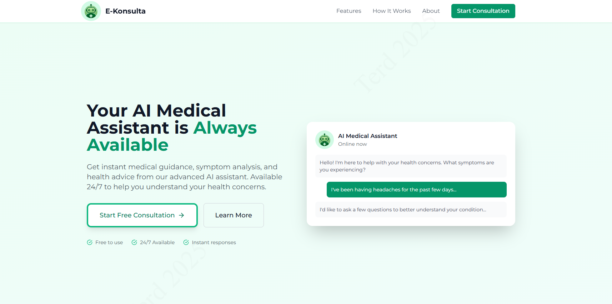

<div align="center">

# 🩺 E-Konsulta — AI Medical Assistant  
**A responsive AI-powered medical chatbot web application built with Next.js and Google Gemini AI.**


</div>

---

## 🖼️ Screenshot

<div align="center">

### 📊 Dashboard

*Interactive AI medical assistant interface showing real-time chat, health guidance, and symptom analysis.*


*Responsive design with typing indicators and streaming AI responses.*

</div>

---

## 🌟 Features

- **24/7 AI Medical Assistance**: Instant AI-driven health guidance  
- **Symptom Analysis**: Describe symptoms and get preliminary recommendations  
- **Real-time Chat Interface**: Interactive chat with typing indicators and streaming responses  
- **Responsive Design**: Works on mobile, tablet, and desktop  
- **Clean Medical UI**: Professional healthcare-themed interface  
- **Progressive Web App (PWA)**: Installable on any device  

---

## 🚀 Technology Stack

- **Framework**: Next.js 14 (React 18)  
- **AI Model**: Google Gemini 1.5 Flash (`@google/generative-ai`)  
- **Styling**: Tailwind CSS  
- **UI Components**: Radix UI, Lucide React, shadcn/ui  
- **Language**: JavaScript / TypeScript  
- **Runtime**: Node.js  

---

## 📋 Prerequisites

- Node.js v18+  
- npm or yarn package manager  
- Google AI API key ([Google AI Studio](https://makersuite.google.com/app/apikey))  

---

## 🔧 Installation

```bash
# Clone repository
git clone https://github.com/terddyy/eKONSULTA.git
cd eKONSULTA

# Install dependencies
npm install
```

Create `.env.local` in the root:

```env
GOOGLE_AI_API_KEY=your_google_api_key_here
# Or alternatively
# GEMINI_API_KEY=your_google_api_key_here
```

Start the development server:

```bash
npm run dev
```

Open [http://localhost:3000](http://localhost:3000) in your browser.

---

## 📝 Available Scripts

* `npm run dev` — Start development server
* `npm run build` — Build production app
* `npm run start` — Start production server
* `npm run lint` — Run ESLint

---

## 📂 Project Structure

```
eKONSULTA/
├── app/
│   ├── api/
│   │   └── consult/
│   │       ├── route.ts
│   │       └── stream/
│   ├── chat/
│   ├── globals.css
│   ├── layout.jsx
│   └── page.jsx
├── components/
│   ├── ChatInput.jsx/tsx
│   ├── TypingIndicator.jsx/tsx
│   └── ui/
├── lib/
│   ├── env.js
│   ├── genAI.ts
│   └── googleAI.ts
├── public/
│   ├── manifest.json
│   └── screenshots/
└── scripts/
    ├── check-models.js
    ├── direct-test.js
    └── test-api.js
```

---

## 🌐 Deployment

### Vercel (Recommended)

1. Push to GitHub
2. Visit [Vercel](https://vercel.com) → Import Repository
3. Add `GOOGLE_AI_API_KEY` in Environment Variables
4. Deploy

[](https://vercel.com/new/clone?repository-url=https://github.com/terddyy/eKONSULTA)

### Netlify / Other Platforms

* Cloudflare Pages, AWS Amplify, Render, Railway, Digital Ocean App Platform

---

## ⚠️ Disclaimer

**E-Konsulta is for informational purposes only.**

* Not a replacement for professional medical advice
* Always consult a physician or qualified healthcare provider
* In emergencies, contact local emergency services immediately

---

## 🧪 Testing

```bash
node scripts/check-models.js   # Check available AI models
node scripts/test-api.js       # Test API endpoints
node scripts/direct-test.js    # Direct AI testing
```

---

## 🛠️ Troubleshooting

* **API Key Issues**: Ensure `.env.local` exists and API key is valid
* **Build Errors**: Clear `.next` cache and reinstall dependencies
* **Node Version**: Must be v18+

---

## 🤝 Contributing

1. Fork the repo
2. Create a feature branch (`git checkout -b feature/AmazingFeature`)
3. Commit changes (`git commit -m 'Add AmazingFeature'`)
4. Push (`git push origin feature/AmazingFeature`)
5. Open a Pull Request

---

## 📄 License

**MIT License** — Open-source and free to modify

---

## 👤 Author

**terddyy**

* GitHub: [@terddyy](https://github.com/terddyy)
* Repository: [eKONSULTA](https://github.com/terddyy/eKONSULTA)

---

## 🙏 Acknowledgments

* Google Gemini AI
* Next.js team
* shadcn/ui
* All contributors and users of E-Konsulta

<div align="center">
Made with ❤️ by <a href="https://github.com/terddyy">terddyy</a>  
<br>
⭐ Star the repo if you find it useful!
</div> 